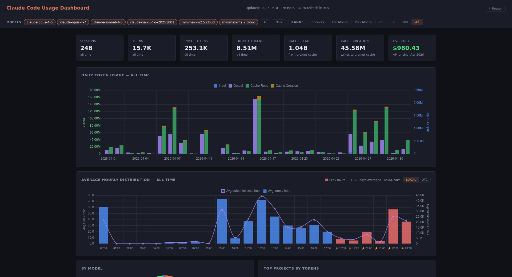

# Claude Code Usage Dashboard

Offline Claude Code usage dashboard. Reads your local
`~/.claude/projects/*.jsonl` transcripts and renders a single-page
dashboard at `http://localhost:8080`. Stdlib only — Python 3.9+ is the
sole external dependency. No registration, no telemetry, no backend.



## Install

### Linux / macOS

```bash
curl -fsSL https://raw.githubusercontent.com/mh-mukul/claude-code-usage/main/install.sh | bash
```

Pin a version:

```bash
VERSION=v0.1.0 bash -c "$(curl -fsSL https://raw.githubusercontent.com/mh-mukul/claude-code-usage/main/install.sh)"
```

The script drops a single `claude-code-usage` file into `~/.local/bin`. If
that's not on your `$PATH`, the installer prints the line to add to
your shell rc.

### Windows (PowerShell)

```powershell
iwr -useb https://raw.githubusercontent.com/mh-mukul/claude-code-usage/main/install.ps1 | iex
```

Installs to `%LOCALAPPDATA%\Programs\claude-code-usage\` and writes a
`claude-code-usage.cmd` shim so you can type `claude-code-usage` from any prompt.

### Manual install

The whole app is a single Python file. Clone the repo (or download
`claude-code-usage.py`) and run it directly:

```bash
chmod +x claude-code-usage.py
./claude-code-usage.py dashboard
```

## Usage

```
claude-code-usage dashboard         # scan + open browser at http://localhost:8080
claude-code-usage scan              # incremental scan only (no server)
claude-code-usage today             # terminal table for today
claude-code-usage week              # last 7 days
claude-code-usage stats             # all-time totals
claude-code-usage --help
```

Dashboard flags:

```
claude-code-usage dashboard \
  --projects-dir /custom/path  \  # override scan dir
  --host 0.0.0.0               \  # bind address (default: localhost)
  --port 9000                  \  # default 8080; auto-walks if busy
  --no-browser                    # don't open a browser
```

The local database is `~/.claude/usage.db`. Re-running `scan` is
incremental — only new lines per JSONL file are parsed (cursor stored
in `processed_files` table).

## How it works

1. **Parser** — walks `~/.claude/projects/**/*.jsonl`, parses each turn,
   dedups by `message.id` (Claude Code emits multiple records per
   API response — the last record carries the final usage tally).
2. **Store** — incremental SQLite at `~/.claude/usage.db`. Schema:
   `sessions`, `turns`, `processed_files` (cursor table). Re-runs only
   re-parse the tail of each modified file.
3. **Dashboard** — `http.server.ThreadingHTTPServer` serves a single
   HTML page + a `/api/data` JSON endpoint. Chart.js loads from
   `cdn.jsdelivr.net` (cached by your browser after first paint).
4. **Pricing** — embedded snapshot of Anthropic's published API rates
   (April 2026). Sync from <https://claude.com/pricing#api> when models
   update. Costs are estimates; Max/Pro subscribers see different
   billing.

## Privacy

- No network calls except the Chart.js CDN hit on first dashboard
  load. After that the page works offline (browser-cached).
- All data stays on your device in `~/.claude/usage.db`.
- The parser only reads your existing `~/.claude/projects/*.jsonl` —
  never modifies them.

## Uninstall

```bash
bash uninstall.sh           # remove the binary, keep the database
bash uninstall.sh --purge   # also delete ~/.claude/usage.db
```

Windows:

```powershell
.\uninstall.ps1
.\uninstall.ps1 -Purge
```

## License

MIT — see [LICENSE](LICENSE).
